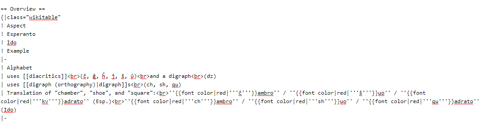
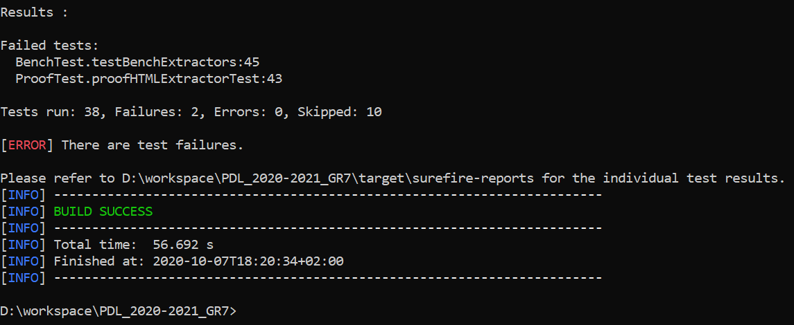

**_Extractor success rate_**
We used the BenchTest.java test with the list of 316 urls presented in largeUrl.test.
We got 1710 csv files for HTML tables and 36 for wikitext tables.
not being able to manually verify all these files, 
we decided according to the pareto law to process 20% of these data.
After study and analysis of the tests we can conclude that 80% of HTML tables have been converted properly which is not at all the case for tables in wikitext.
for the first URL of the text we obtain 9 files CSV for HTML and 0 for Wikitext however the table are in Wikitext aso cf the picture.
  

**study of the existing**

- First of all we notice that the client does not have the right to choose the page from which he wants to extract the tables.
- When we extract the URl tables from the large_url_test.txt file, we have a very lower number of comparison in wikitext compared to those in HTML, i.e. less than 20% of the comparisons.
- The tests which check the validity of the Urls are ignored so the Urls are used without being tested.
- GetUrlValidesTest() test no passed in test/wikiExtractMain
- The attributes and methods presented in the class diagram are not the same as in the code , even some relations
- The use of SOP (system.out.println)
- A class and its attribute with the same name (url)
- The use of thread but we don't have processes
- testerConnexion336Urls() ,invalid equals condition
- The technical architecture is missing in the description of project into the DESIGN.md
- testGetNbTableaux() failed ,String json = recupContenu(url.getURL()); ===> return error json
                              so this condition prevents treatment : if(!hasErrorOnPage(json)
- titreLangueInexistente() unit test resolved in src/Java/com.wikipediaMatrix/Url
- detectionLanguesNonGeree() unit test resolved in test/java/com.wikipediaMatrix/UrlTest
- List of pass tests
  
                      